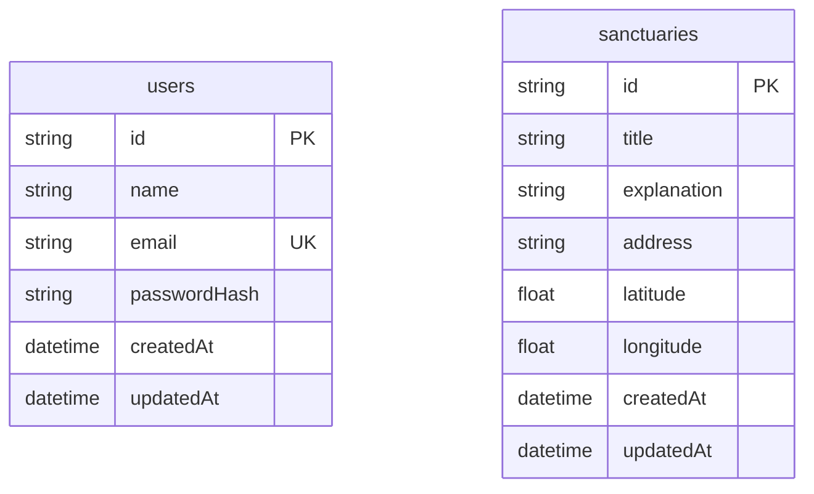

# Snow Map

## サービス概要

SnowMapは、アイドルのSnow Manのライブ遠征中に、現在地から近い聖地を探せる聖地巡礼マップサービスです。

## アプリURL

https://snowmap-sigma.vercel.app/

## 機能紹介

| トップページ | 聖地一覧ページ |
| --- | --- |
| サービス概要と導線を表示しています。 | 聖地一覧・地図・距離表示を確認できます。 |
|  |  |

| 聖地投稿ページ | 聖地詳細ページ |
| --- | --- |
| 地図上で場所を選択し、聖地情報を投稿できます。 | 聖地の詳細情報が確認できます。 |
|  |  |

## 画面遷移図

[画面遷移図](https://www.figma.com/design/tEflFalftk3I3mKSgH92eo/snow%E3%83%9E%E3%83%83%E3%83%97?node-id=0-1&p=f&t=oVzoapPVIJJSy3NS-0)

## このサービスへの思い・作りたい理由
このサービスを考えたきっかけは、私自身の Snow Man のライブ遠征での体験です。

初めて長野から国立競技場のライブへ遠征した際、土地勘がなく、開演前の時間を会場周辺でただ過ごしてしまいました。ライブ後に「周辺の聖地を事前に知っていたら、短い時間でも巡れたかもしれない」と感じました。

遠征では移動やスケジュールの制約が多く、限られた時間をどう使うかが重要です。しかし、今いる場所から近い聖地を簡単に知る手段が少ないことに不便さを感じました。

この経験から、土地勘のない遠征先でも空き時間を後悔なく使えるサービスを作りたいと考え、SnowMapを開発しています。

## ユーザー層について

本サービスでは、以下のユーザー層を主な対象としています。

### 遠征オタクのAさん

**基本情報**

* 年齢：20代〜40代
* 性別：女性
* 立場：Snow Man のファン
* ITリテラシー：

  * Google マップを使って目的地検索や経路確認ができる
  * スマートフォンアプリの操作に抵抗がない

---

### このユーザー層を対象にした理由

- Snow Man の聖地巡礼ニーズが高く、サービスのテーマと関心が一致するため
- ライブ遠征が多く、土地勘のない状況になりやすい（空き時間の課題が発生しやすい）ため
- Googleマップ利用ができるため、地図UIの学習コストが低いと考えられるため
- 自身の実体験と重なるユーザー像であり、困りごとや必要機能を具体的に想像しやすいため

## サービスの利用イメージ
ユーザーはライブ遠征前または当日に本サービスを利用します。  
現在地、もしくはライブ会場周辺を指定すると、今いる場所から近い聖地が地図上に表示されます。
距離やカテゴリを見て、短い空き時間でも「行ける場所」を判断しやすくなり、迷う時間を減らせます。  
結果として、遠征先での空き時間を有効に使え、ライブだけでなくその土地での体験も思い出として残せるようになります。

## ユーザーの獲得について
本サービスでは、以下の方法でユーザーにサービスを届けることを想定しています。

- 本サービス専用のSNSアカウントを運用し、聖地情報や使い方、利用シーンを発信します
- 知り合いの Snow Man ファン（ジャニオタ）に使ってもらい、フィードバックを得て改善します
- 小さなコミュニティでの口コミによる拡散を狙い、無理のない形で継続的に育てていきます

## サービスの差別化ポイント・推しポイント

Snow Man の聖地に関する情報は、
個人ブログや記事、SNS 投稿など、すでに点在しています。

しかし、それらと本サービスには明確な違いがあります。

---

### ① 「記事を読むサービス」ではなく「行動を助けるサービス」である点

既存の聖地巡礼記事やブログは、
情報量が多く読み応えがある一方で、

* 今いる場所からどこが近いのか分かりにくい
* 遠征当日の短い空き時間に使いづらい
* 地図と照らし合わせる必要がある

といった課題があります。

本サービスは、
**「読む」ことよりも「すぐ行ける場所を判断する」ことに重点**を置いています。

現在地をもとに近い聖地を表示することで、
遠征中でも直感的に行動できる点が大きな差別化ポイントです。

---

### ② 一人の発信に依存しない、継続可能な形を目指している点

個人ブログや記事は、
一人の熱量と労力によって支えられているケースが多く、

* 情報更新の負担が大きい
* 継続が難しい
* 情報が古くなりやすい

といった問題を抱えやすいと感じています。

本サービスでは、
一人がすべてを抱え込むのではなく、
**ファン同士で情報を共有・蓄積していける仕組み**を前提に設計しています。

これにより、情報の偏りや更新負荷を分散し、継続的に聖地情報を更新していける点が強みです。

### ③ 遠征という「時間制限のある状況」に特化している点

既存の情報発信は、
「いつか行く」「時間に余裕がある」前提で書かれているものが多くあります。

一方、本サービスは

* ライブ遠征
* 開演前の限られた時間
* 土地勘のない状況

といった **制約の多いシーンに特化**しています。

「今日はここまで行けるかどうか」
「今からでも行ける場所はどこか」
を判断できる点が、このサービスならではの強みです。

## 実装済み機能

### ユーザー認証
- ユーザー登録
- ログイン
- ログインしているユーザーのみ投稿・編集ページにアクセス可能

### 聖地投稿
- 聖地の新規投稿
- 聖地の編集
- 場所名、住所、説明文の登録
- 住所から緯度・経度を取得して保存

### 聖地一覧
- 投稿された聖地の一覧表示
- Google Maps上に聖地を表示
- 現在地取得
- 現在地から聖地までの距離表示
- 現在地から近い順での並び替え

### 聖地詳細
- 聖地の詳細情報を表示

## 今後実装したい機能

- お気に入り機能
- 訪問記録機能
- メンバー・カテゴリごとの絞り込み
- 投稿者ごとの編集権限管理

## 使用する技術スタック

### フロントエンド
- Next.js 16.1.6
- React 19.2.3
- TypeScript
- Tailwind CSS 4

### バックエンド / 認証
- Next.js App Router
- NextAuth 5.0.0-beta.30
- Prisma 6.19.2
- bcryptjs

### データベース
- PostgreSQL（Neon）
- Prisma ORM

### 外部API
- **地図API**
  - Google Maps JavaScript API
  - Geocoding API

### インフラ / デプロイ
- **デプロイ先**
  - Vercel

## ER図

