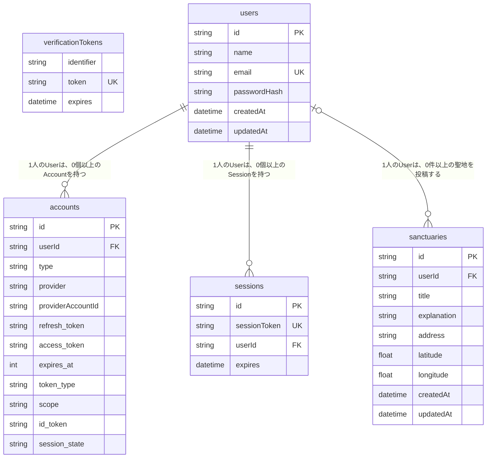

# SnowMap

## サービス概要

SnowMapは、現在地から近いSnow Manの聖地を探せる、聖地巡礼マップサービスです。

地図上で聖地の場所を確認でき、ユーザー同士でSnow Manに関連する撮影地やロケ地を投稿・共有できます。

## アプリURL

https://snowmap-sigma.vercel.app/

## デモアカウント

以下のアカウントでログインできます。

- メールアドレス：test@example.com
- パスワード：testtest

## 機能紹介

| トップページ | 聖地一覧ページ |
| --- | --- |
| サービス概要と導線を表示しています。 | 聖地一覧・地図・距離表示を確認できます。 |
|  |  |

| 聖地投稿ページ | 聖地詳細ページ |
| --- | --- |
| 地図上で場所を選択し、聖地情報を投稿できます。 | 聖地の詳細情報が確認できます。 |
|  |  |

## 画面遷移図

[画面遷移図](https://www.figma.com/design/tEflFalftk3I3mKSgH92eo/snow%E3%83%9E%E3%83%83%E3%83%97?node-id=0-1&p=f&t=oVzoapPVIJJSy3NS-0)

## このサービスを作った理由

このサービスを考えたきっかけは、私自身がSnow Manのライブで遠征した際の経験です。

初めて長野から国立競技場へ遠征したとき、周辺の土地勘がなく、開演前の時間をうまく活用できませんでした。

ライブ後に「会場の近くにある聖地を事前に知っていたら、短い時間でも巡れたかもしれない」と感じました。

遠征では、移動時間や開演時間などの制約があり、限られた時間をどう使うかが重要です。

そこで、土地勘のない遠征先でも、現在地から近い聖地を地図上で簡単に探せるサービスを作りたいと考え、SnowMapを開発しました。

## ユーザー層について

本サービスでは、以下のユーザー層を主な対象としています。

### 遠征オタクのAさん

**基本情報**

* 年齢：20代〜40代
* 性別：女性
* 立場：Snow Man のファン
* ITリテラシー：

  * Google マップを使って目的地検索や経路確認ができる
  * スマートフォンアプリの操作に抵抗がない

---

### このユーザー層を対象にした理由

- Snow Man の聖地巡礼ニーズが高く、サービスのテーマと関心が一致するため
- ライブ遠征が多く、土地勘のない状況になりやすい（空き時間の課題が発生しやすい）ため
- Googleマップ利用ができるため、地図UIの学習コストが低いと考えられるため
- 自身の実体験と重なるユーザー像であり、困りごとや必要機能を具体的に想像しやすいため

## サービスの利用イメージ

ユーザーは、ライブ遠征前または遠征当日に本サービスを利用します。

現在地周辺の聖地を地図上で確認し、現在地からの距離を見ながら、限られた空き時間でも行ける場所を判断できます。
これにより、聖地を探す時間や地図で場所を調べ直す手間を減らし、遠征先での空き時間を有効に使えるようになります。ライブだけでなく、聖地巡礼を含めた遠征全体を思い出として残せるサービスを目指しています。

## 実装済み機能

### ユーザー認証
- ユーザー登録
- ログイン・ログアウト
- ログインユーザーのみ聖地を投稿可能
- 未ログインユーザーによる投稿・編集ページへのアクセス制限

### 聖地投稿
- 聖地の新規投稿
- 聖地の編集（ログインユーザーであれば誰でも可能）
- 聖地の削除（投稿者本人のみ可能）
- 場所名、住所、説明文の登録
- 住所から緯度・経度を取得して保存

### 聖地一覧
- 投稿された聖地の一覧表示
- Google Maps上への聖地表示
- 現在地の取得
- 現在地から聖地までの距離表示
- 現在地から近い順への並び替え

### 聖地詳細
- 聖地の詳細情報を表示
- 投稿者名を表示

## 今後実装したい機能

- お気に入り機能
- 訪問記録機能
- メンバー・カテゴリごとの絞り込み

## 使用技術

### フロントエンド
- Next.js 16.1.6
- React 19.2.3
- TypeScript 5.9.3
- Tailwind CSS 4.2.1

### バックエンド / 認証
- Next.js App Router
- NextAuth 5.0.0-beta.30
- Prisma 6.19.2
- bcryptjs 3.0.3

### データベース
- PostgreSQL（Neon）

### 外部API
- **地図API**
  - Google Maps JavaScript API
  - Geocoding API

### インフラ / デプロイ
- **デプロイ先**
  - Vercel

## ER図

